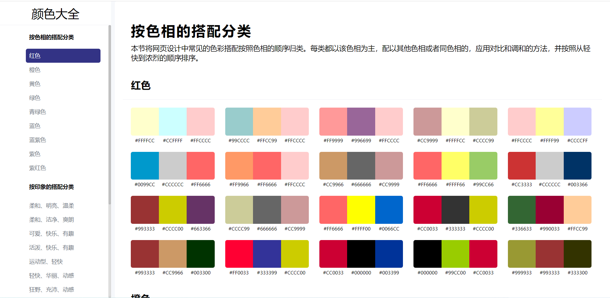

# web_color

#### 介绍
前端UI配色辅助RGB颜色调色板配色表HTML源码，颜色大全，配色大全 网站源码 配色网站，各类样式的配色
RGB颜色调色板配色表html源码分享，站长引流工具，色彩搭配看似复杂，但并不神秘。

既然每种色彩在印象空间中都有自己的位置，那么色彩搭配得到的印象可以用加减法来近似估算。

将网页设计中常见的色彩搭配按照色相的顺序归类。搭配起来就会得到千变万化的感觉。

#### 界面预览

#### 使用说明

下载源码直接打开index.html即可
